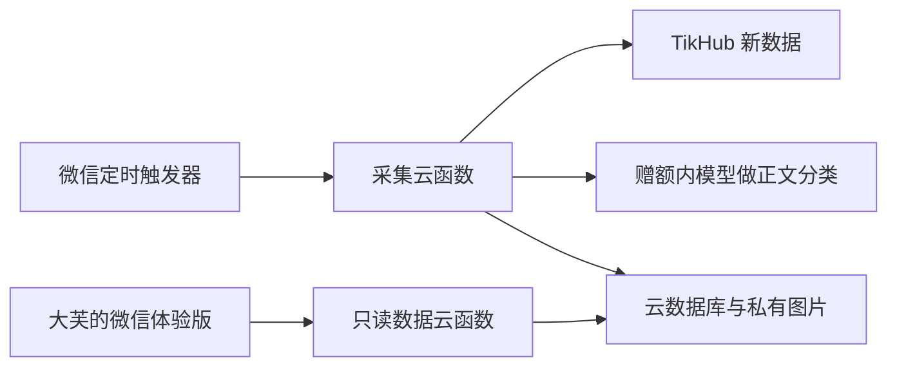

# Implementation Plan: 单人、低成本、定时更新的微信体验版

**Feature**: `001-wechat-member-trial` | **Date**: 2026-09-12 | **Spec**: [spec.md](spec.md)

**Status**: 本文件维护实现方案；实施进度见[任务清单](tasks.md)，实际环境与验收见[运行记录](../../docs/operations/wechat-trial-runbook.md)。

**Branch**: `feature/wechat-member-trial`。2026-09-13 起源码与规格统一在项目根目录，旧英文路径仅作兼容，不合并或推送 main。

## Summary

让大芙一人使用微信体验版；云端每天北京时间 09/12/20 三轮重新采集和自动判断，页面读取云端新结果。7 篇作者参照、5 天黑马、现有三个板块、搜索排序往期与本机收藏保留。

优先申请成长计划的半年个人版环境与适用模型赠额；领不到再评估当前 19.9 元/月个人版。用户最初批准 50 次数据请求/日，17/17/16 分配；每轮轮换一组两个关键词，各查询图文/视频一页近一周结果，再按各板块时间窗筛选。2026-09-13 起新增每天 06:00 今日新锐扫描（55 个关键词、一天内、第 1 页），日上限调整为 150 次，见文末同日方案。详情见 [费用方案](cost-options.md)。

## Technical Context

- **Language/Version**: 原生小程序 JavaScript/WXML/WXSS；普通云函数 Nodejs20.19（当前官方推荐）。本地默认 Node 24.11.0；已另外用 Node 20.19.0 通过全部 49 项功能测试。
- **Primary Dependencies**: `wx-server-sdk`、`@cloudbase/node-sdk`、小程序官方类型声明及 TypeScript 检查工具；实施时核对并锁定版本，不用漂移的 latest。
- **Storage**: 上海可用的文档型数据库和私有云存储；本机收藏使用微信存储。不创建关系型库、多租户或自助注册后台。
- **Testing**: Node 内置测试运行器，收费边界使用录制响应及模拟故障；前端用 `checkJs` 做受影响类型检查，最终用微信开发者工具与指定手机验证。
- **Target Platform**: 微信体验版，开发者工具本机已安装。AppID 已取得，微信 CLI 已成功生成真实预览包；体验成员已添加，指定成员真机链路仍待核验。
- **Performance Goals**: 前台发布后 60 秒内发现更新；排序搜索交互目标 1 秒内响应；实际采集耗时在受限真实试跑中记录，不承诺整点完成。
- **Constraints**: 费用未配置则拒绝收费调用；客户端不可触发采集；无公开 HTTP 写入口；缺失指标与未知内容不得冒充有效值。
- **Scale/Scope**: 一个实际使用者加维护验收账号；三个代码模块，预计 30–40 个源码/配置/测试文件，按高风险流程实施和独立审查。

## Constitution Check

原实施阶段按用户会话中的 AGENTS 约定执行。2026-09-13 已接入[项目原则 1.0.0](../../.specify/memory/constitution.md)和[开发细则](../../docs/standards/README.md)，后续方案与修改按共同原则检查。以下保留原实施证据，不能冒充新版本重新验收。

- 先调查与分步计划：完成，范围见下面四个阶段。
- 涉及部署、密钥与持续付费：是；已获得整体方案与费用上限确认，按阶段实施。
- 超过两个模块/十个文件：是；分阶段验证，实施后独立审查，修复后再审。
- 付费验证上限：已确认首次最多 20 次 / $0.20、日最多 50 次 / $0.50，重试计入上限；代码默认关闭收费。
- 外部资源：账号与成长计划环境已开通；个人版实际到期2027-03-12、赠额到账和云端管理员权限已核验。
- 现有网页与旧采集试跑不改：作为本次边界。方案不是自动采集长期稳定性的保证。

实施复核：代码层独立审查及离线验证已通过，可进入已授权的云端配置与受限真实验证。

## Architecture



### 调度与预算

低成本版不每分钟全天空跑。一个定时器在三个更新窗口每 2 分钟触发，代码只在 09:00、12:00、20:00 建轮，并在各窗口前 20 分钟推进剩余批次；其余触发立即退出。实施配置可用小时列表 9/12/20 及分钟步长 2，再由业务判断窗口；账号若支持更精确 cron 范围，可直接限制 0–20 分钟；第 20 分钟仅做收尾，不再采集。具体表达式在部署前用离线日期表校验。

每次函数超时 180 秒，150 秒起停止领取；全局单工作者租约及确定轮次编号防重复运行。一次领取最多 5 个请求，并发最多 2，单请求最长 40 秒；结束前保存进度。窗口过期仍未完成则记录范围和原因，不无限补跑。

费用以整数最小货币单位核算。请求、轮次、日期预算在事务中一并预留；网络调用在事务外；结果未知保持费用占用。重试最多一次且再次占额度；只对可重试错误重试，认证/价格异常立即停止。预算未批准时数值为空而非默认无限。

### 自动内容与排序

优先移植已验证 TikHub 字段映射，补齐完整正文可用性检查、时区和置顶未知状态。按规则先筛再查：今日 24 小时至少 1000 赞；本周 7 天至少 10000 赞；黑马 5 天且作者粉丝至多 5000。7 篇参照取候选之前的作品，中位数是排序后第 4 个值。

模型只做正文分类，返回 `cooking/not_cooking/uncertain` 和原文证据；不执行工具，不接受正文中的指令，不创造菜谱。优先选择成长计划实际支持并已到账的混元模型，非赠额使用先核价并明确预算。

同轮作者历史共用但每篇候选单独选择前 7 篇，跨轮重新获取；同轮相同正文和封面不重复处理。已推荐作品不再进入后续新推荐，但保留在历史中。

### 发布与读取

写不可变结果分片，逐片验证后建立清单，最后在一个短事务内标记轮次已发布并切换可用结果指针。采集未完成或整体失败不清空旧结果。覆盖不足但有完整有效作品可发布 `partial` 快照，页面明确说明。

去重记录绑定发布轮次，只有对应轮次已发布才生效；上传中的草稿不得提前使候选永久消失。工作者租约限制同一时间只有一个发布者，过期租约的旧执行不能提交新指针。

读取接口仅从本次云函数第二参数解析微信身份，校验AppID和服务端配置的获准OpenID；不使用可能残留上一位身份的进程环境或客户端event。实际用户只有一人，使用配置白名单，不搭建成员申请和审批后台。初次身份绑定由开发者工具和云控制台完成，面向大芙的页面不暴露配置细节。

数据库客户端默认拒绝直接读写。只读函数只能签发当前查询结果所属图片，不能接收任意 fileID；图片临时地址短期有效，过期重新读取。

### 原文与收藏

复制真实来源链接，失败明确提示；使用小红书原文时要求登录或内容失效均如实说明。当前 TikHub 官网称不再返回 xsec token，与本地旧样本不同，实际响应需重新核验；不能继续承诺免登录直达。

收藏仅本机保存，更新轮次不丢失。搜索覆盖已保存轮次，结果按笔记编号去重并取最新发布快照中的信息；历史查询采用分页以免一次加载全部数据。

## Project Structure

规格与计划留在当前 `specs/001-wechat-member-trial/`。

代码以下均相对实际仓库 `/Users/liyadong/Documents/GitHub.nosync/美食博主工作台/`：

```text
miniprogram/
  app.js, app.json, app.wxss
  pages/index/index.js, index.json, index.wxml, index.wxss
  lib/api.js, view.js, favorites.js
cloudfunctions/
  collectTick/
    index.js, package.json
    lib/config.js, provider.js, judge.js, ranking.js
    lib/store.js, budget.js, runner.js, publisher.js
  catalog/
    index.js, package.json
    lib/access.js, queries.js
config/rules.json, keywords.json, cloudbaserc.example.json
project.config.json
package.json, jsconfig.json, .gitignore
tests/collector.test.js, safety.test.js, catalog.test.js, frontend.test.js
docs/operations/wechat-trial-runbook.md
```

环境真实配置和密钥不提交；新增目录不会覆盖 `src/template.html`、`build.py`、旧 `data/rounds/` 或当前网页。

## Phased Delivery

1. **基础与收费边界**：配置、数据状态、预算预留、平台身份校验。先跑重复领取、并发预算、未授权读取与无预算零调用的离线测试。
2. **真实自动采集链路**：字段迁移、自动正文判断、7 篇排名、5 天黑马、跨轮去重、原子发布。先用本地录制响应验证，再在批准额度内做一轮真实云端验证。
3. **小程序交互**：三个板块、更新状态、轮次、搜索排序、本机收藏、复制原文。做受影响逻辑测试和前端类型检查，再用开发者工具验证。
4. **受限云端体验交付**：确认活动资格与资源报价、部署、绑定单用户、真实定时触发、真机六项验收。安排独立审查并修复；未验证项保持未完成。

## Enablement Checklist

- 完整方案及低成本覆盖取舍获得确认。
- 小程序 AppID、个人主体与后台上传/体验能力可用；能添加大芙为体验成员。
- 成长计划能领取且已到账，或最低付费套餐及资源费用明确获准。
- 首轮/每日数据费和模型费预算确定，价格配置完成核验。
- 密钥仅放云端环境，采集函数不能被小程序用户直接触发。
- 离线安全与正确性验证通过，同一源码状态完成独立审查。

## Remaining Risks

更少的关键词和页数会降低发现覆盖，不能保证相同数量或质量；需用三天结果再调预算。当前体验版已设置，指定成员访问仍未实测；个人版实际到期和模型赠额到账已核验，模型单独到期时刻未展示，按官方6个月政策记录。外部API与模型已经在授权上限内完成两轮取数，仍需后续正式轮次观察。

## 2026-09-12 配额策略补充

用户已在手机云配额管理中选择超额按量付费，Agent 保留该选择，不擅自关闭。数据接口的日调用限制不能视为腾讯云账单硬上限；数据接口、模型用量和云资源账单分别核算。当前已向用户提交正式实施确认：首次真实验证最多 20 次数据调用，日上限建议 50 次（或用户选择 30 次）；用户已明确选择每天最多 50 次，包含重试；首轮最多 20 次并计入当日总额。真实采集已在代码验证、独立审查和实际云端权限核验后启用。

## 2026-09-12 实施进度

源码、权限/预算/数据/前端逻辑已实现；Node 20.19.0 的 49 项测试全部通过。定向独立审查发现的问题均已修复并复审。小程序实际预览编译包 46,311 字节，预览命令退出码 0。

首次创建的默认占位函数已由正确配置替代；两函数现为Nodejs20.19、180/30秒，数据库和存储均ADMINONLY。19:08真实验收和20:00正式定时已完成，日账36次/$0.36，临时触发时刻已移除。

### 定时器来源适配（实测补充）

腾讯云原生 SCF Timer 的实际 SOURCE 为空，18:52 的独立诊断已记录，旧的仅 wx_trigger 检查会在进入采集前拒绝。原生路径改用仅在云端和 CustomArgument 中保存的随机口令，并继续拒绝用户上下文；不放宽预算、时间窗或客户端权限。该适配按高风险权限变更独立复审后部署。

### 历史纠正与封面补齐

原有低粉黑马300赞门槛已恢复；一条35赞旧结果隐藏并保留审计。采用新快照和引用的单事务切换，不清账、不改取数时间。后续封面补齐同样只替换fileId，其余正文、指标和排序保持，当前3篇均有封面。

腾讯云数据库同一事务内必须顺序发出操作；事务外互不依赖的读取才并行。平台只读对照已验证这一约束。

### 当前请求身份隔离

已在真实云端测试中发现混合调用时SDK可能继承旧WX环境变量，按官方实例复用文档改为parseContext解析本次参数；两个入口共用同一实现。25项受影响测试通过，部署后的伪造身份读取和伪造定时调用均已拒绝。

## 2026-09-13 今日新锐 06:00 扫描

**范围**：只改采集云函数、规则与关键词配置、定时表达式和本功能文档；读取接口和小程序页面不改。开发在独立工作树的 `feature/today-hot-sweep` 分支进行。部署前另行确认，并与同时进行的登录任务协调采集函数的部署内容。

**调度**：沿用 `food-picks-timer`，表达式改为 `0 0-30/2 6,9,12,20 * * * *`。06:00 轮在第 0–28 分钟采集、第 30 分钟收尾；09/12/20 仍在第 0–18 分钟采集、第 20 分钟收尾，第 22–30 分钟的触发直接退出。每天触发 64 次（原 33 次）。

**请求与预算**：06:00 轮先发 55 次搜索，再细查今日候选；单轮最多 100 次，常规三轮仍为 17/17/16，日合计 150 次 / 1.50 美元。预算模块硬上限改为日 150 次、1,500,000 微美元；预留时只有 06:00 扫描轮可用到 100 次，其他轮次仍不超过 20 次。未配置 06:00 额度即不扫描；日额度扣除 06:00 后超过 50 次或少于 3 次、金额上限低于“次数 × 0.01 美元”、验收时刻与定时窗口重叠时，配置拒绝加载。单次触发的请求上限由 5 个提到 10 个，仍串行，105 秒后不再领取新工作。

**候选与展示**：06:00 轮只接纳 24 小时内至少 1000 赞的作品，细查后不再满足的直接跳过，不做判断和粉丝查询；其他候选仍来自常规三轮。同时达到 1 万赞的作品按原规则同时列入本周板块。启用扫描后，06:30 以后发布的常规轮读取当天 06:00 已发布快照，把其中的今日作品连同已有的本周板块放入本轮快照，但不写搜索行和去重引用。临时读取出错时本轮先不发布，由窗口内的后续触发重试，窗口结束仍失败才降级。06:00 未运行或未发布（缺口 `SWEEP_UNAVAILABLE`），或快照损坏、读取始终失败（缺口 `CARRY_UNAVAILABLE`）时，本轮照常发布自己的新选题并标记部分覆盖，`coverage.carriedToday.errorCode` 记录 `SWEEP_MISSING`、`SWEEP_NOT_PUBLISHED`、`CORRUPT_SNAPSHOT`、`NOT_FOUND` 或 `CARRY_READ_FAILED`。窗口结束时如果搜索和候选都已完成，不再记“窗口已结束”缺口。

**验证**：新增 `tests/daily-sweep.test.js`，覆盖调度、配置越界与验收时刻重叠、55 词参数、单次触发上限、共享日预算、非扫描轮 20 次硬上限、真实请求模块跨次续跑并停在 100 次、只收今日候选、细查后超出今日窗口即跳过、当天带上与次日不带、过万赞作品保留两个板块、06:00 缺失/未发布/损坏、临时读取失败重试与窗口结束降级、判断次数上限说明和带上作品的发布去重；同步更新 `tests/safety.test.js` 越界预算用例与 `scripts/check-schedule.js` 时刻表。按高风险变更独立审查，修复后复审。

**风险**：云函数运行时间和数据库结果记录增加，腾讯云超额按量付费仍开启，需在部署前后核对用量。每轮最多 20 次内容判断的限制不变，千赞候选超过 20 个时第 21 个起本轮不再判断，现单独提示“判断次数已达上限”。06:00 快照成为最新一轮后，09:00 前页面的本周和黑马板块只显示该轮结果（黑马必为空）。“类型不限”的第 1 页以视频为主，可能漏掉图文，需首轮观察。页面板块副标题仍写“近 24 小时”，实际以 06:00 为准，文案交由界面任务更新。单个请求含重试最长约 80 秒，贴近 105 秒领取时可能超过 180 秒函数超时（原有风险）；该请求按结果未知占用额度，不会超额。
